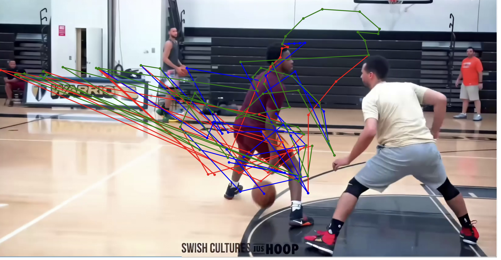
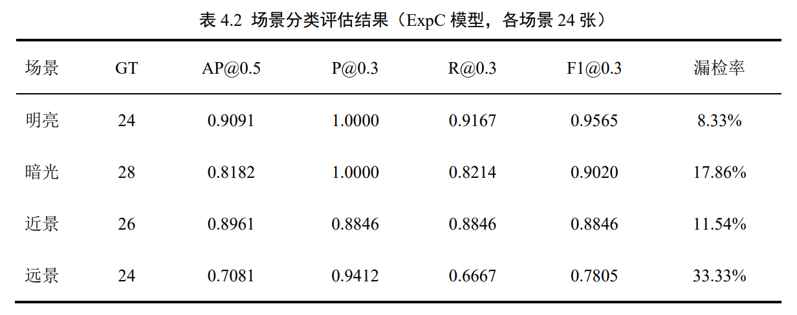

# 基于RetinaNet的篮球目标检测与追踪算法研究

## 📋 项目简介

本项目基于RetinaNet深度学习模型，构建了一套篮球检测与运动轨迹分析方案。通过整合多源数据集和优化训练策略，实现了在复杂比赛场景下的篮球目标检测与轨迹追踪。

## 🎯 主要工作

### 1. 数据集构建
- 整合Basketball Detection、Basketball Players、SportsMOT等公开数据集
- 补充自采视频帧，覆盖多种比赛场景
- 训练集：**1956张** | 验证集：**124张**
- 场景覆盖：明亮、暗光、近景、远景

### 2. 模型优化
- 基础模型：RetinaNet（ResNet50-FPN骨干网络）
- 分类头修改：篮球/背景二分类结构
- 训练策略：混合精度训练、梯度裁剪、早停机制
- 最优模型在合并测试集上的性能：

| 指标 | 数值 |
|------|------|
| AP@0.5 | **0.9002** |
| P@0.3 | **0.9375** |
| R@0.3 | **0.8936** |
| F1@0.3 | **0.9150** |

### 3. 跨场景验证
在四种典型场景下测试模型泛化能力：

| 场景 | AP@0.5 | 特点 |
|------|--------|------|
| 明亮 | 0.9091 | 效果最好，无误检 |
| 近景 | 0.8961 | 均衡，偶有遮挡漏检 |
| 暗光 | 0.8182 | 受光照影响，召回率下降 |
| 远景 | 0.7081 | 小目标检测仍有提升空间 |

### 4. 轨迹分析方法对比

设计了两种轨迹生成方法：

| 方法 | NTE | Overlap@5% | 特点 |
|------|-----|-----------|------|
| **SORT逐帧检测-跟踪** | **0.102** | 71.7% | 精度高，适合轨迹分析 |
| **抽帧静态检测+线性插值** | 0.369 | 60.4% | 覆盖率高，适合事件检测 |
## ⚠️ 条件限制

### 数据集限制
- **样本规模有限**：训练集仅1956张，对于复杂场景覆盖不足
- **类别单一**：仅包含篮球单一类别，未涉及球员、裁判等其他目标
- **场景局限**：数据集以室内篮球场为主，室外场景数据较少
- **标注质量**：部分样本存在标注偏差，影响模型训练效果

### 模型限制
- **检测精度瓶颈**：远景场景AP@0.5仅0.7081，小目标检测性能不足
- **实时性约束**：31.76 FPS在高端显卡上实现，低配设备难以满足实时需求
- **泛化能力**：模型在训练数据分布外的场景（如不同光照条件、不同角度）表现下降
- **遮挡处理**：球员身体遮挡导致跟踪断裂，遮挡场景NTE显著升高至0.440

### 轨迹分析限制
- **SORT方法**：依赖检测精度，遮挡时易出现ID切换；计算量大，不适合边缘设备
- **插值方法**：精度较低（NTE=0.369），快速变向时插值轨迹与真实轨迹偏差大
- **单目标跟踪**：未实现多篮球同时跟踪，实际比赛中可能出现多球场景

### 硬件与环境限制
- **显卡依赖**：需要NVIDIA GPU支持CUDA加速，CPU推理速度大幅下降
- **内存需求**：模型加载和批量推理需要较大显存（建议8GB以上）
- **操作系统**：当前仅在Windows 11上测试，Linux/Mac兼容性未验证

## 🔧 改进方案

### 短期改进（1-2个月）

| 改进方向 | 具体措施 | 预期效果 |
|----------|----------|----------|
| **数据增强** | 增加Mosaic、MixUp、CutMix等高级增强策略 | 提升模型泛化能力，暗光场景AP提升5-10% |
| **小目标优化** | 引入BiFPN替代FPN，增加P2特征层 | 远景场景AP@0.5提升至0.80+ |
| **损失函数** | 尝试Varifocal Loss或Quality Focal Loss | 提升检测框定位精度 |
| **跟踪优化** | 采用DeepSORT替代SORT，引入外观特征 | 遮挡场景跟踪鲁棒性提升，减少ID切换 |

### 中期改进（3-6个月）

| 改进方向 | 具体措施 | 预期效果 |
|----------|----------|----------|
| **多帧融合** | 引入光流法或时序特征融合（如TCN、LSTM） | 解决运动模糊问题，检测稳定性提升 |
| **模型轻量化** | 采用MobileNet/ShuffleNet骨干网络，或模型剪枝量化 | 推理速度提升至60+ FPS，适配边缘设备 |
| **多目标跟踪** | 扩展至多篮球跟踪，引入轨迹预测机制 | 支持复杂比赛场景，提升实用性 |
| **数据扩充** | 收集更多室外场景、不同光照条件数据 | 跨场景泛化能力显著提升 |

### 长期改进（6个月以上）

| 改进方向 | 具体措施 | 预期效果 |
|----------|----------|----------|
| **端到端优化** | 采用YOLOv8/v9或RT-DETR等先进检测器 | 精度与速度双重提升，AP@0.5目标0.95+ |
| **多模态融合** | 结合音频、球员姿态等多模态信息 | 提升复杂场景理解能力 |
| **云端部署** | 模型部署至云端，提供API服务 | 支持大规模并发，降低本地硬件要求 |
| **实时分析系统** | 构建完整比赛分析平台，集成战术分析 | 从检测跟踪升级至智能分析系统 |

## 🛠️ 环境要求

- **操作系统**：Windows 11
- **Python**：3.10
- **深度学习框架**：PyTorch 2.11.0
- **CUDA**：12.8
- **显卡**：NVIDIA GeForce RTX 4060 Ti (16GB)
- **其他依赖**：torchvision, OpenCV, Albumentations, MMDetection

## 📁 项目结构

```
basketball-detection-retinanet/
├── README.md              # 项目介绍
├── requirements.txt       # Python依赖包
├── results/               # 实验结果
│   ├── images/            # 图片结果
│   └── videos/            # 视频演示
├── docs/                  # 文档说明
└── scripts/               # 辅助脚本
```

## 📊 实验结果展示

### Precision-Recall曲线


### 轨迹对比


### 场景检测结果


### 检测演示视频
📹 [查看检测演示视频](results/videos/detection_demo.mp4.mp4)

## 🔍 核心难点分析

1. **运动模糊**：快速运动导致检测框不稳定
2. **遮挡场景**：球员身体遮挡造成跟踪断裂
3. **远景小目标**：像素占比低，特征提取困难

## 🚀 未来改进方向

- 引入光流法或多帧融合应对运动模糊
- 结合DeepSORT提升遮挡场景跟踪鲁棒性
- 采用BiFPN、超分辨率技术提升小目标检测精度

## 👤 作者信息

- **姓名**：zy

## 📄 许可证

本项目仅用于学术研究，遵循相关数据集的原始授权协议。

## 📧 联系方式

如有需要数据集与模型或有问题、建议，欢迎通过GitHub Issues交流。


